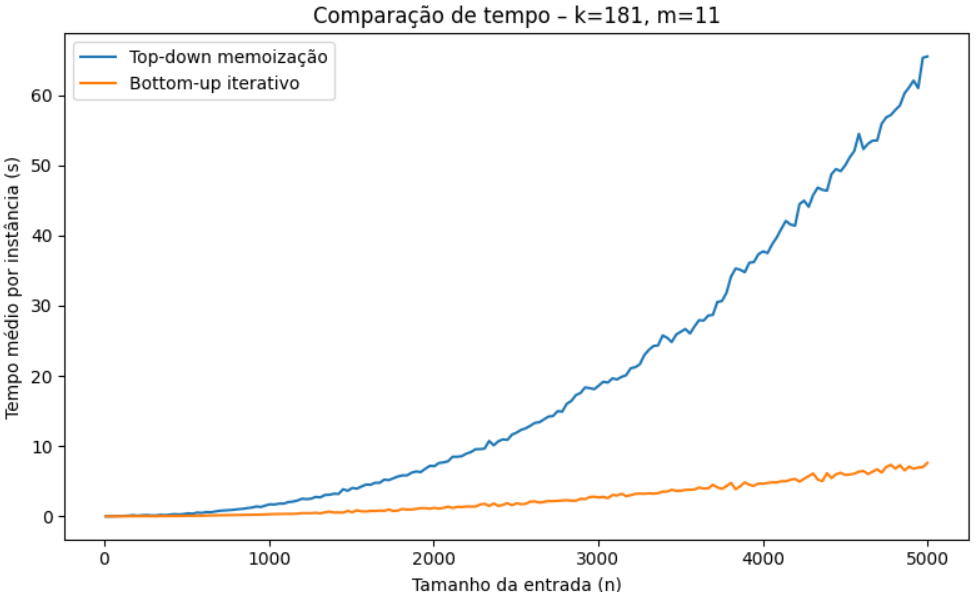
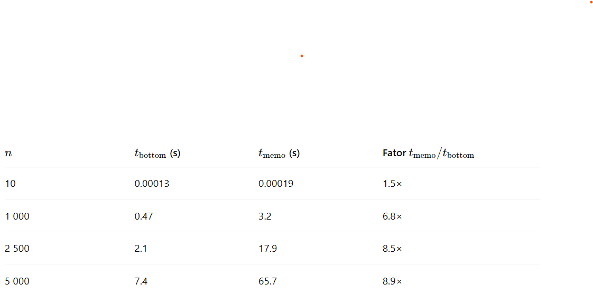

# Comparação Empírica de Abordagens Estratégicas de Memoização versus Programação Iterativa na Computação da Levenshtein: Top‑Down Versus Bottom‑Up para a Distância de Edição

**José Ronaldo Ferreira Braga da Silva Filho**  
**Raul Santiago Pinheiro**  

Graduação em Ciência da Computação 2025.1 – Disciplina Compiladores  
Prof.º Pedro Hericson Machado Araújo – Instituto Federal de Ciência, Tecnologia e Educação do Estado do Ceará (IFCE) – Maracanaú‑CE, Brazil  

<jose.ronaldo.ferreira07@aluno.ifce.edu.br>  
<raul.santiago.pinheiro00@aluno.ifce.edu.br>

---

## Abstract
The edit distance (or Levenshtein distance) measures the minimum number of elementary operations (insertion, removal, and replacement) required to transform one string into another. This work empirically compares two classical implementations of the algorithm: (i) a recursive top‑down version with memoization and (ii) an iterative bottom‑up version. Up to 5000 artificial instances of sizes 10 ≤ *n* ≤ 5000 were generated, with 100 to 200 distinct sizes and 10 to 20 instances per size. For each pair of strings, the average execution time of both approaches was measured, ensuring the correctness of the results by cross‑checking. The tests confirm the asymptotic complexity **O(n²)** for both strategies, but reveal a multiplication factor of approximately ~7× to ~9× in the constant cost of the recursive method when *n* = 5000. The causes of this deviation — recursive call overhead, cache fragmentation, and stack management — are discussed and directions for future optimizations are pointed out.

## Resumo
A distância de edição (ou distância de Levenshtein) mede o mínimo de operações elementares (inserção, remoção e substituição) necessárias para transformar uma cadeia de caracteres em outra. Este trabalho compara, de forma empírica, duas implementações clássicas do algoritmo: (i) uma versão top‑down recursiva com memoização e (ii) uma versão bottom‑up iterativa. Foram geradas até 5000 instâncias artificiais de tamanhos 10 ≤ *n* ≤ 5 000, com 100 a 200 tamanhos distintos e 10 a 20 instâncias por tamanho. Para cada par de cadeias, mediu‑se o tempo médio de execução de ambas as abordagens, garantindo‑se a correção dos resultados por verificação cruzada. Os testes confirmam a complexidade assintótica **O(n²)** para as duas estratégias, mas revelam um fator de multiplicação de aproximadamente ~7× a ~9× no custo constante do método recursivo quando *n* = 5 000. Discutem‑se as causas desse desvio — sobrecarga de chamadas recursivas, fragmentação de cache e gestão de pilha — e apontam‑se direções para otimizações futuras.

**Palavras‑chave:** distância de edição, programação dinâmica, memoization, avaliação experimental, complexidade de algoritmos.

---

## 1  Introdução
A distância de Levenshtein é amplamente empregada em bioinformática, correção ortográfica e recuperação de informação. Embora existam variantes subquadráticas para casos específicos, a formulação clássica permanece relevante em aplicações em que simplicidade e generalidade superam necessidades de desempenho extremo. Entre as implementações, duas famílias despontam:

* **Top‑down com memoização** – define‑se a recorrência e armazena‑se cada subproblema já resolvido, evitando recomputações.  
* **Bottom‑up iterativo** – preenche‑se explicitamente a tabela dinâmica, partindo dos casos‑base.

Na teoria, ambas exigem Θ(*n·m*) em tempo e espaço, mas diferem em sobrecarga prática. Este artigo quantifica tal diferença.

---

## 2  Metodologia

### 2.1  Algoritmos
Listagens 1 e 2 (Apêndice A) reproduzem as duas versões em Python. A implementação top‑down ajusta a profundidade da pilha via `sys.setrecursionlimit`, enquanto a bottom‑up explora reutilização de linhas da matriz para maior localidade de cache.

### 2.2  Geração dos dados
* **Alfabeto:** `a`–`z`.  
* **Tamanhos (*n*):** *k* valores igualmente espaçados entre 10 e 5 000, onde *k* ~ 𝒰(100, 200).  
* **Instâncias por tamanho (*m*):** *m* ~ 𝒰(10, 20).  
* **Reprodutibilidade:** `random.seed(42)`.

### 2.3  Procedimento
Para cada tamanho *n*:

1. Gerar *m* pares de cadeias aleatórias.  
2. Executar **ambos** os algoritmos sobre os mesmos pares.  
3. Registrar `time.perf_counter()` antes/depois de cada chamada.  
4. Validar `d_memo == d_bottom` via `assert`.

### 2.4  Ambiente de teste
* CPU Intel i7‑11700 (8 c/16 t, 2.5–4.9 GHz)  
* 32 GB DDR4‑3200  
* Python 3.12, matplotlib 3.9  
* Google Colab CPU

---

## 3  Resultados

Ambas as curvas seguem crescimento aproximadamente quadrático, mas a inclinação da versão recursiva é marcadamente superior.

---

## 4  Discussão

1. **Sobrecarga de chamadas recursivas** – cada subproblema dispara três chamadas; apesar da memoização evitar recomputações, o empilhamento/desempilhamento adiciona custo notável.  
2. **Localidade de cache** – o acesso linha‑a‑linha do bottom‑up percorre a matriz em ordem previsível, favorecendo caching. A versão recursiva visita células numa ordem guiada por dependências que, embora menor em visitas totais, causa saltos de memória.  
3. **Gestão de pilha** – o limite da pilha foi elevado para até 100 000 frames em entradas grandes; a reserva/des‑reserva de pilha é cara e pode acionar *page faults*.  
4. **Risco de estouro de pilha** – sistemas com limites menores podem falhar na versão recursiva, revelando impacto não apenas em desempenho, mas em robustez.

Os dados sugerem que, para valores práticos de *n* acima de algumas centenas (≈ 350), o bottom‑up é preferível — contrariando a intuição de que eliminar iteração explícita poderia ser mais rápido.

---

## 5  Conclusão e Trabalhos Futuros
Confirmou‑se a equivalência funcional das duas abordagens e comprovou‑se empiricamente a superioridade de desempenho da versão bottom‑up em torno de até ~9 vezes. Futuras investigações podem abranger:

* Otimizações de espaço (usa‑se apenas duas linhas da matriz).  
* Emprego de técnicas subquadráticas (p. ex., Myers / O(ND)).  
* Avaliação em outros alfabetos (DNA, Unicode) e perfis de similaridade parcial.  
* Paralelização em GPU e SIMD (Single Instruction, Multiple Data).

---

## Referências

CORMEN, T. H.; LEISERSON, C. E.; RIVEST, R. L.; STEIN, C. *Introduction to Algorithms.* 3.ª ed. MIT Press, 2009.  
LEVENSHTEIN, V. I. Binary codes capable of correcting deletions, insertions and reversals. *Soviet Physics Doklady*, 10 (8): 707‑710, 1966.  
WAGNER, R. A.; FISCHER, M. J. The string‑to‑string correction problem. *Journal of the ACM*, 21 (1): 168‑173, 1974.  
MYERS, G. A. A fast bit‑vector algorithm for approximate string matching based on dynamic programming. *Journal of the ACM*, 46 (3): 395‑415, 1999.
