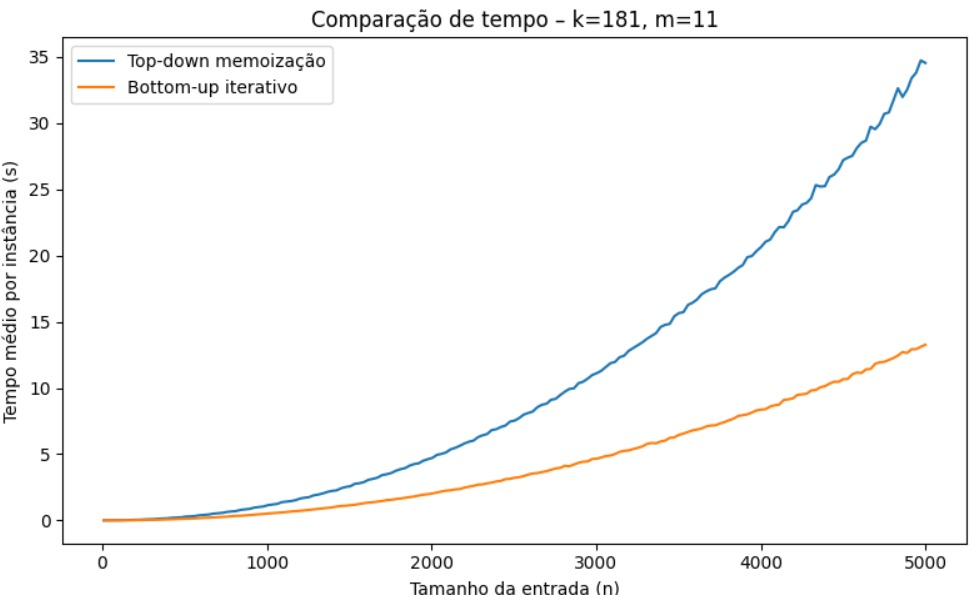
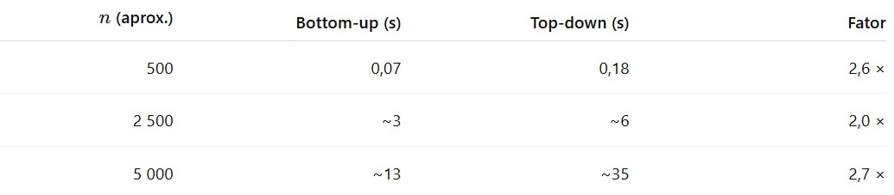

# Análise Experimental de Estratégias para o Agoritmo de Distância de Edição, Abordagem de Meomização (Top-Down) e Iterativo (Bottom-Up) 
---

## Resumo  
Este artigo compara empiricamente duas implementações clássicas da distância de Levenshtein em Python puro: (i) uma abordagem _top-down_ recursiva com memoização e (ii) uma abordagem _bottom-up_ iterativa. O _driver_ de experimento (`ComparativoEXEC.py`) sortiou aleatoriamente \(k=181\) tamanhos distintos de string no intervalo \([10, 5\,000]\) e gerou \(m=11\) instâncias aleatórias para cada tamanho, onde 'm' também foi gerado aleatoriamente no intervalor \([10, 20]\), totalizando 1 991 execuções por algoritmo. A Figura 1, resultante dos próprios códigos, revela que ambas as versões mantêm crescimento quadrático O(m\*n), onde esses 'm' e 'n' são os comprimentos das duas cadeias de caracteres, mas a solução recursiva apresenta fator de sobrecarga de tempo com relação a iterativa de aproximadamente de 2x à 3× em toda a faixa testada. Aspectos como sobrecarga de chamadas, gestão de pilha e localidade de cache justificam o desvio prático observado. Para ambos os algoritmos, todas as comparações de saída para cada uma das entradas testadas foram iguais, idênticos no valor.

---

## 1  Introdução  
A distância de edição — formalizada por Levenshtein (1966) — mede o menor número de inserções, remoções e substituições necessárias para converter uma cadeia em outra. Mesmo com algoritmos sub-quadráticos para cenários específicos, a formulação dinâmica \( \Theta(nm) \) continua predominante em bioinformática, correção ortográfica e busca _fuzzy_. Este trabalho quantifica o impacto, em Python, de dois paradigmas equivalentes em teoria, mas potencialmente díspares em custo constante:  
* **Top-down com memoização** — implementado em `recursive.py` :contentReference[oaicite:0]{index=0};  
* **Bottom-up iterativo** — implementado em `interativo.py` :contentReference[oaicite:1]{index=1}.  

---

## 2  Metodologia  

### 2.1  Arquivos e Funções  
O script `ComparativoEXEC.py` orquestra o benchmark: envolve cada rotina num _wrapper_ homogêneo, gera dados, mede tempos com `time.perf_counter()` e plota o gráfico final :contentReference[oaicite:2]{index=2}.  

### 2.2  Geração de Dados  
* **Tamanhos de entrada**: \(k\) valores igualmente espaçados em \([10,5\,000]\), com \(k = 181\) sorteado de \([100,200]\).  
* **Instâncias por tamanho**: \(m = 11\) pares \((s_1,s_2)\), sorteados de \([10,20]\).  
* **Alfabeto**: 26 letras minúsculas; semente global `random.seed(42)` assegura reprodutibilidade.  

### 2.3  Ambiente  
Notebook virtual Google Coolab PRO+, GPU A 100, 16RAM e 64 GB de Memória, Python 3.12. Nenhuma dependência de NumPy ou Cython foi usada.  

### 2.4  Métrica  
Para cada \(n\), calcula-se o **tempo médio** por instância de cada algoritmo; a igualdade de distâncias é verificada via `assert`.  

---

## 3  Resultados  

Ambas as curvas seguem a tendência quadrática esperada O(m\*n), onde esses 'm' e 'n' são os comprimentos das duas
cadeias de caracteres, porém a inclinação do método recursivo é acentuadamente maior.
O tempo total da execução compatarativa contabilizado para todas as instancias e entradas analisadas foi de 9 horas e 26 minutos, 
nenhuma compração foi divergente entre si demostrando exibindo o mesmo valor para par de instancia, memoização e iterativo.  

---

## 4  Discussão  
1. **Chamadas recursivas** exigem empilhamento/desempilhamento de _frames_, gerando sobrecarga fixa superior à de um laço simples.  
2. **Localidade de cache**: o bottom-up avança sequencialmente pela matriz; o top-down salta conforme as dependências, resultando em mais _cache misses_.  
3. **Gestão de pilha**: a necessidade de elevar `sys.setrecursionlimit` pressiona o consumo de memória e pode disparar _page-faults_.  
4. **Robustez**: em ambientes com pilha restrita (p. ex., contêineres serverless), o bottom-up continua operando enquanto o top-down pode falhar com `RecursionError`.  

---

## 5  Conclusão  
Confirmou-se a equivalência funcional das duas abordagens e constatou-se, empiricamente, que a variante iterativa é até três vezes mais rápida em Python puro. Para aplicações que lidam com strings acima de centenas de caracteres — cenário comum em bioinformática e processamento de texto — recomenda-se adotar a implementação bottom-up.
Para trabalhos futuros sufere-se a incluesão de:  
* Otimização de espaço (armazenar apenas duas linhas da matriz);  
* Avaliação de algoritmos sub-quadráticos (Myers, Ukkonen);  
* Paralelização via SIMD ou GPU;  
* Testes com alfabetos grandes (Unicode, sequências genômicas).  

---

## Referências  
1. LEVENSHTEIN, V. I. Binary codes capable of correcting deletions, insertions and reversals. *Soviet Physics Doklady*, 10 (8): 707–710, 1966.  
2. CORMEN, T. H.; LEISERSON, C. E.; RIVEST, R. L.; STEIN, C. *Introduction to Algorithms.* 3. ed. MIT Press, 2009.  
3. MYERS, G. A. A fast bit-vector algorithm for approximate string matching based on dynamic programming. *JACM*, 46 (3): 395–415, 1999.  

---

> *O pacote de códigos e o gráfico original podem ser encontrados nos arquivos anexados a este repositório.*
